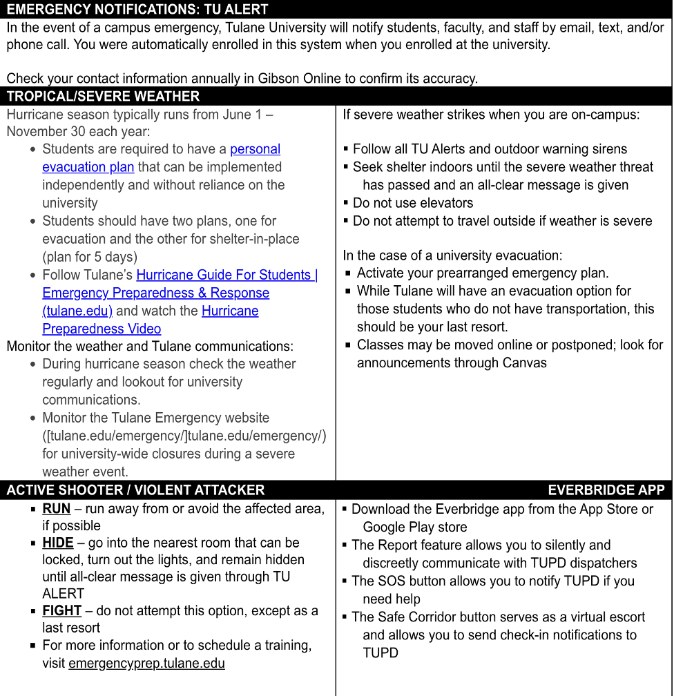

::::: {.grid .course-details .course-details-smaller}
::: g-col-6
### Instructor

-      []()
-      
-      <a href="mailto: kcallison@tulane.edu">kcallson\@tulane.edu</a>

### Office Hours

-      
-      
-      
:::

::: g-col-6
### Course Details

-      
-      
-      
:::
:::::

### Course Descripton

The primary aim of this course is to present an overview of health policy in American government, its scope, dynamics, and conceptual and practical dilemmas. It is designed to acquaint students with major issues involved in formulating, implementing, and assessing patterns of decisions established by government. Because the study of policy is essentially interdisciplinary, readings for the course have been drawn from several fields, including sociology, political science, and economics. Specific areas of consideration will be addressed during the seminar through analysis and discussion of the functions of state and local government and various stakeholder groups that attempt to influence governmental action.

### Prerequisites

HPAM 7100 (Can be taken concurrently with permission.)

### Learning Objectives

After completing this course, students will be able to do the following:

1. Exhibit a conceptual understanding of the forces and factors accounting for legislation and regulation pertaining to     health services.\
2. Develop a framework to critically discuss and evaluate policy issues affecting the U.S. health care system.\
3. Compare and contrast the public policy objectives of various stakeholders with the realities of the political            process.\
4. Critically evaluate the research literature that examines the federal and state roles in health services.\
5. Evaluate current proposals advanced in Congress and by the private sector that impact health services delivery.\
6. Demonstrate a working understanding of the legislative process and the related federal and state regulation              processes.\

### Competency Mapping

| Competency | Signature Assessment |
|:----------------------------------------|:------------------------------|
| 1\. Apply economic and legal concepts and theories to the analysis of healthcare policy and management issues. | Long answer exam questions requiring application of economic, statutory (EMTALA, HIPPA, tax exemption, antitrust) and regulatory concepts to practical hypothetical scenarios that take place in hospitals or other settings. |
| 2\. Analyze the impact of health policies using fundamental research and analytical methods. | Empirical Paper Assignment: An analysis of Applied health and social policy topics such as an evaluation of the ACA, health insurance coverage, health care access, demographic trends, public program participation, public program eligibility, health surveillance, or health disparities. |
| 3\. Illustrate how the evidence base in health policy literature supports a health policy. | Literature Review: Critical literature review assessing the existing support for policy alternatives to a student-chosen problem. |
| 4\. Communicate health policy issues effectively orally. | Presentation that communicates the issues (stakeholders, criteria, alternatives) around a chosen health policy. |
| 5\. Examine policy interventions that address social determinants of health, promote health equity, and reduce health disparities. | Memo that evaluates the impacts of policy interventions using a method (Bardach or other) for health policy analysis. |

### Course Structure

The course structure for HPAM 7660 - Health Policy Analysis is designed to facilitate active student participation and integrate a combination of lectures, data labs, group activities, and case presentations. The class sessions are organized into thematic units that explore the U.S. health policy landscape, policy analysis methodologies, and policy evaluation. By combining these components, the course aims to ensure students develop both theoretical knowledge and practical skills in health policy analysis

### Course Materials

#### Required Materials

We will use the following online (and free!) textbook along with various readings that will be posted to the course website under the Assignments tab.

-   Ismay, Chester and Albert Y. Kim. 2022. [*Statistical Inference via Data Science: A ModernDive into R and the Tidyverse*](https://moderndive.com/index.html).

We'll use R in this class to conduct data analysis. R is free, open source, and available on all major platforms. [RStudio](http://www.rstudio.com) (also free) is a user interface for R that is commonly used to work with the R language. R is available in all Tulane computer labs and you are encouraged to bring your laptop to class if you're able to. [Data Lab 1](/materials/Data Labs/datalab_1.qmdx) will walk you through setting up R and RStudio on your laptop.

#### Recommended Materials

If you're new to health care institutions in the U.S. and the mechanics of federal and state policymaking, this text may be helpful:

Barr, D. *Introduction to US Health Policy: The Organization, Financing, and Delivery of Health Care in America*, 4th Edition. ISBN-13: 978-1421420721

### Assessment of Learning

The following components and weights will be used to calculate your final grade:

| Category                                    | Percent of Final Grade |
|:--------------------------------------------|:-----------------------|
| Policy Advocacy Materials                 | 25%                    |
| Data Analysis Proposal                          | 25%                    |
| Participation (contributing to class discussions, asking relevant questions, and engaging in group activities) | 25%                    |
| Data Labs & Problem Sets | 15%                    |
| Peer Assessment                             | 10%                    |
| Total                                       | 100%                   |

 
Your final course grade will be calculated according to the following ranges:

| Letter Grade | Percentage    |
|:-------------|:--------------|
| A            | 94.5% and above |
| A-           | 89.5 to 94.49%   |
| B+           | 87.5 to 89.49%   |
| B            | 82.5 to 87.49%   |
| B-           | 79.5 to 82.49%   |
| C            | 69.5 to 79.49%   |
| F            | Below 69.5%      |

### Description of Required Assignments:

*Policy Advocacy Materials* - throughout the semester, as part of a team, you will construct materials for a policy advocacy campaign focused on a state-level policy issue that aligns with [Louisiana Progress'](https://www.louisianaprogress.org/) legislative priorities. Teams will be assigned a policy issue at the beginning of the semester and will work to generate the following materials:   

1. Landscape analysis - Feb. 24th\
2. Proposed solution - Mar. 31st\
2. Issue one-pager - Apr. 7th\
3. Infographic - Apr. 14th\
4. Committee Testimony - TBD\

*Data Analysis Proposal* - throughout the semester, as part of a team, you will develop a policy evaluation proposal related to the work we'll do in the Data Labs throughout the semester. The proposal will consist of the following sections:

1. Specific Aims (1 page) - Mar. 3rd\
2. Significance (1 page) - Mar. 19th\
3. Methods (1 page) - Apr. 21st\
4. Conclusion (0.5 pages) - Apr. 28th\

*Data Labs & Problem Sets* – Data labs will be completed in class and should be submitted through the Canvas link on the course web site. Problem sets will be due by the beginning of class and should be submitted through the Canvas link on the course web site. I will post the problem sets to the web site at least a week in advance of the due date. 

*Peer Assessment* - The peer assessment component of your grade will consist of anonymous grading of your team contribution by the other members of your team (more specific details to follow).

### Attendance Policy

Class attendance is a critical component of learning, and students are expected to attend and participate fully in all scheduled class meetings and activities. While there is no specific attendance grade in the course, class absences will reflect negatively on student participation scores. Students are responsible for notifying instructors and the Office of Student Experience about significant absences that result from serious illnesses, injuries, or critical personal problems. Students experiencing barriers to meeting attendance requirements due to disabilities are encouraged to register with the Goldman Center for Student Accessibility to discuss accommodation and to make the necessary arrangements with their instructor.

### ADA/Accessibility Statement

Tulane University is committed to offering classes that are accessible. If you anticipate or encounter disability-related barriers in a course, please contact the [Goldman Center for Student Accessibility](https://accessibility.tulane.edu/) to establish reasonable accommodations. If approved by Goldman, make arrangements with me as soon as possible to discuss your accommodation so that they may be implemented in a timely fashion. I will never ask for medical documentation from you to support potential accommodation needs.

### Student Code of Academic Content

Students are required to adhere to the Unified Code of Graduate Student Academic Conduct, available online [here](https://ogps.tulane.edu/sites/default/files/Unified%20Code%20of%20Graduate%20Student%20Academic%20Conduct%20-%202024%20Final%20(1).pdf).

Each student enrolled in the School of Public Health and Tropical Medicine has the responsibility to read, understand and follow the code of academic conduct. Lack of knowledge of code or its application does not constitute an excuse for non-compliance.  Tulane University expects and requires behavior compatible with its high standards of scholarship. By accepting admission to the university, a student accepts its regulations and acknowledges the right of the university to take disciplinary action.

### Artificial Intelligence Policy

There are no restrictions on the use of AI in this course. Use of AI tools such as ChatGPT are encouraged for class writing assignments (e.g., policy memo sections). However, you should note that these tools are unlikely to generate high quality work on their own. The best use of these tools involves editing and refining draft materials that you have written yourself.  

### Welcoming Community Statement

Tulane’s core value of “welcoming community” means that we cultivate classrooms and other learning spaces where students, faculty, and staff can thrive and reach their full potential no matter their backgrounds, experiences, or perspectives. In this classroom, we empower you to participate in building this supportive culture and climate for every member of our community, which requires practicing cultural humility and perspective-taking with people who may have divergent or similar viewpoints. Please be familiar and mindful of our Student Handbook Code of Conduct policies and [Tulane’s Nondiscrimination Statement](https://hr.tulane.edu/ii-equal-opportunity-anti-discrimination-policies#:~:text=Tulane%20prohibits%20discrimination%20in%20its,%2C%20sex%2C%20sexual%20orientation%2C%20or). 

### Religious Accomodation Policy

Per Tulane’s [religious accommodation policy](https://registrar.tulane.edu/academic-calendars/religious-observance-policy), I will make every reasonable effort to ensure that students are able to observe religious holidays without jeopardizing their ability to fulfill their academic obligations. Excused absences do not relieve the student from the responsibility for any course work required during the period of absence. Students should notify me within the first two weeks of the semester about their intent to observe any holidays that fall on a class day or on the day of the final exam.

### Title IX

Tulane University recognizes the inherent dignity of all individuals and promotes respect for all people. As such, Tulane is committed to providing an environment free of all forms of discrimination including sexual and gender-based discrimination, harassment, and violence like sexual assault, intimate partner violence, and stalking. If you (or someone you know) has experienced or is experiencing these types of behaviors, know that you are not alone. Resources and support are available: you can learn more [here](https://allin.tulane.edu/content/all). 

## Disclosures of gender-based discrimination 
In order to comply with the requirements of Title IX of the Education Amendments of 1972, Tulane University requires all faculty members to report incidents of gender-based discrimination. Please know that if you choose to confide in me, I am required by the university to share your disclosure in a Care Connection to the Office of Case Management and Victim Support Services to be sure you are connected with all the support the university can offer. The Title IX Coordinator is also notified of these disclosures. You choose whether or not you want to meet with these offices. You can also make a disclosure yourself, including an anonymous report, through this [form](https://tulane.edu/concerns).

## Statement on Confidentiality and Privacy
Tulane University is committed to protecting the privacy of all individuals involved in a disclosure of gender-based discrimination. Any and all of your communications on these matters will be treated as either “Confidential” or “Private.”

| Confidential | Private |
|:-----------------------------------|:-----------------------------------|
| Certain individuals and resources (see list below) are designated as confidential. Individuals and resources designated as confidential will not share any information, except in extreme circumstances involving imminent danger to one’s self or others, with the Office of Case Management and Victim Services, the Title IX Coordinator, or local law enforcement without the express permission of the disclosing party. | Private resources means that information related to a disclosure of gender-based discrimination may be shared with key staff members of the University to assist in the review, investigation, or resolution of the disclosure or to deliver resources, accommodations, and support services. Information pertinent to the disclosure will be shared with the following Offices:  |
| Counseling & Psychological Services (CAPS):  (504) 314-2277 | Case Management & Victim Support Services (CMVSS): (504) 314-2160 |
| Student Health Center  Downtown: (504) 988-6929  Uptown: (504) 865-5255 | Tulane University Police (TUPD)  Downtown: (504) 988-5531  Uptown: (504) 865-5911 |
| Sexual Aggression Peer Hotline and Education (SAPHE): (504) 654-9543 | Title IX Coordinator: (504) 865-5611 or email: titleix\@tulane.edu |

## Title IX Safeguards for Pregnant and Parenting Students
Title IX also provides reasonable protections and support for pregnant and parenting students. Discrimination on the basis of a student’s pregnancy, childbirth, false pregnancy, termination of pregnancy, or recovery from any of the previous conditions is prohibited by Title IX, and Tulane is committed to providing equal access to academic programs and extracurricular activities to students who might be, are, or have been pregnant.  If you need support related to a pregnancy or any of the previously listed conditions, visit pregnancy.tulane.edu for more information, including a list of resources. Student who believe that they may have experienced pregnancy discrimination can file a complaint with the Title IX Office by contacting 504-865-5611 or titleix@tulane.eduor visiting the office in Jones Hall 308, filing a report at: https://cm.maxient.com/reportingform.php?TulaneUniv=&layout_id=0

### Emergency Preparedness & Response

